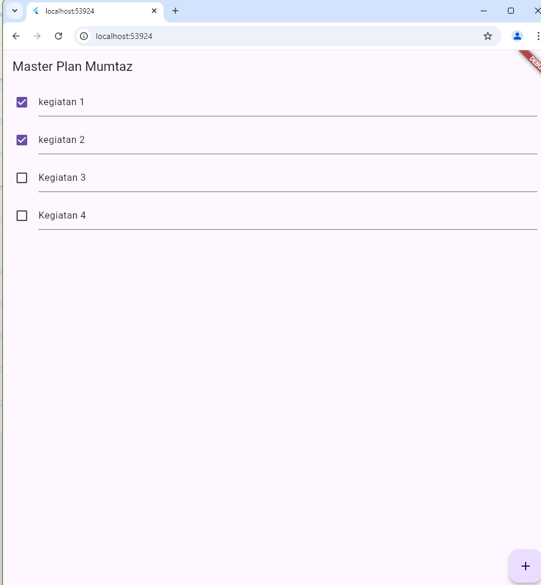
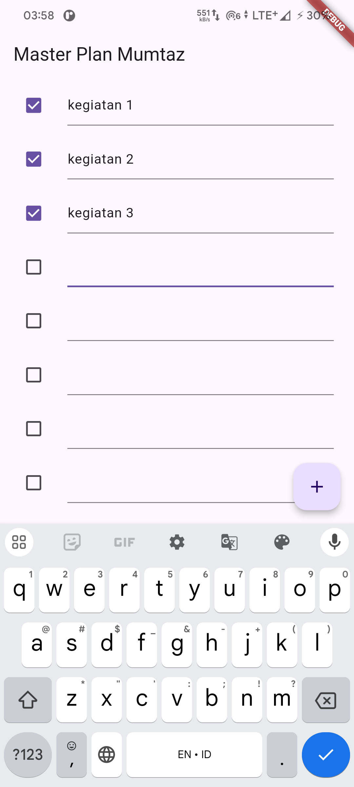
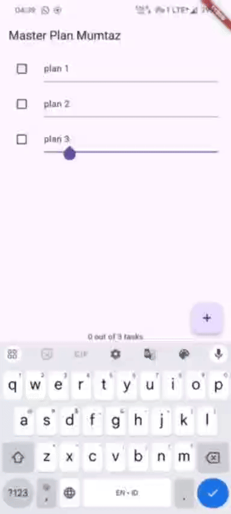
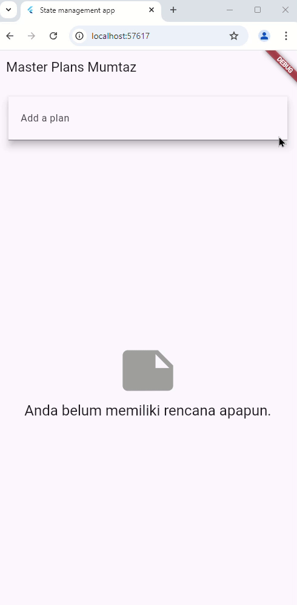

# master_plan

A new Flutter project.

## Tugas Praktikum 1

2. Langkah 4 digunakan untuk menggabungkan ekspor dari beberapa file menjadi satu, sehingga modul-modul yang lain bisa mengimpor semua kelas yang diekspor dengan lebih mudah dari satu tempat saja.
3. Variabel plan adalah objek dari kelas Plan. Kelas Plan memiliki dua properti: name, yang merupakan string, dan tasks, yang merupakan daftar tugas (List<Task>).
menggunakan const karena objek ini dijamin tidak akan berubah.
4. 

5. Metode initState dipanggil sekali ketika state dari widget pertama kali diinisialisasi. Ini adalah tempat untuk melakukan inisialisasi yang hanya perlu dilakukan sekali, seperti membuat objek ScrollController. Metode dispose dipanggil ketika widget dihapus dari widget tree, seperti saat layar diganti atau widget dihancurkan. Ini digunakan untuk membersihkan resource agar tidak terjadi memory leak.

## Tugas Praktikum 2
2. PlanProvider menjadi InheritedWidget yang menyediakan ValueNotifier. Menggunakan InheritedNotifier memberikan keuntungan dalam hal reaktivitas. ValueNotifier yang ada di dalamnya memungkinkan objek Plan untuk berubah dan memberitahu semua widget yang bergantung padanya ketika data berubah. Dengan demikian, InheritedNotifier lebih cocok digunakan ketika data yang disediakan bersifat mutable (dapat berubah), dan akan memperbarui UI secara otomatis ketika data tersebut berubah.
3. get completedCount adalah getter untuk properti completedCount, yang akan mengembalikan jumlah tugas yang telah selesai (complete). get completenessMessage adalah getter untuk properti completenessMessage, yang akan mengembalikan string yang berisi pesan mengenai jumlah tugas yang telah selesai dan total tugas.
4. 

## Tugas praktikum 3
Gambar ini menunjukkan bagaimana aplikasi Flutter bernavigasi di antara layar. Di sisi kiri, kita memiliki PlanCreatorScreen, yang menunjukkan tata letak layar dan widgetnya. Di sisi kanan, kita memiliki PlanScreen, yang menampilkan layar yang ditampilkan setelah Navigator Push digunakan untuk bernavigasi dari PlanCreatorScreen.

Navigator Push adalah fungsi yang digunakan untuk menavigasi ke layar baru di Flutter. Ketika kita memanggil Navigator Push dari PlanCreatorScreen, aplikasi akan memindahkan pengguna ke PlanScreen.

Kita dapat melihat bahwa PlanScreen memiliki widget yang berbeda dibandingkan dengan PlanCreatorScreen. Ini menunjukkan bahwa aplikasi telah berpindah ke layar baru.
